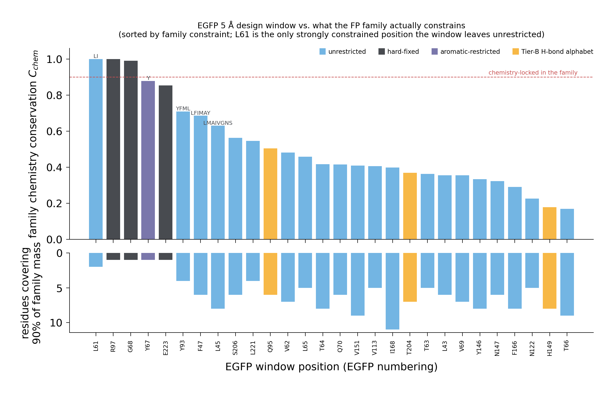

# Whole-dataset FP alignment and chemistry conservation

A multiple sequence alignment of **every unique sequence in the curated FP dataset**
(763 proteins, 82 source organisms) and a per-position analysis of what side-chain
**chemistry** the family holds fixed — as opposed to what amino-acid **identity** it
holds fixed.

Headline result: **conservation in this family is overwhelmingly about the fold, not
about the chromophore.** Chemistry is locked at exactly twice as many positions as
identity (28 vs 14 at the 90% level), and the strength of that locking tracks how
buried a position is (Spearman ρ = −0.40 with solvent accessibility) while having *no*
relationship at all to how close it sits to the chromophore (ρ = −0.003, p = 0.96).
The colour-tuning pocket is the family's variable real estate, pinned by only three
invariant chemical anchors: **Gly67**, **Arg96⁺** and **Glu222⁻**.

## Pipeline

```bash
python build_msa_input.py     # curated union -> data/fp_all.fasta          (763 seqs)
./run_msa.sh                  # MAFFT FFT-NS-i -> data/fp_all.aln.fasta     (~4 min)
python conservation.py        # -> results/column_conservation.csv, summary.json
python validate.py            # -> results/validation.json   (4 robustness tests)
python report.py              # -> results/findings.txt      (numbers quoted below)
python compare_design_windows.py   # -> results/design_window_*.csv, window_family_alphabet.csv
python esm_vs_family.py       # -> results/esm_vs_family_egfp.csv, esm_calibration.csv (needs GPU)
python esm_profiles.py        # -> results/esm_profiles.npz, esm_sweep_profiles.npz,
                              #    esm_family_sweep.csv   (needs GPU, ~9 min)
python figures.py             # -> figures/*.png
```

`visualization.ipynb` then renders the seven-figure ESM-2-vs-family comparison
(`figures/esm_vs_msa_*.png`) from those cached distributions; it needs no GPU of its own.

Needs `mafft` (`mamba install -c conda-forge mafft`) in the `esm2-fp-design` env;
everything else is already there (biopython, biotite, pandas, scipy, matplotlib).

## What was aligned

The union of the three curated trait sets — peak (758) plus what brightness and pKa
add (2 + 3) = **763 unique sequences**. The 5 extras are proteins the peak curation
dropped as analyte sensors (`CAR-GECO1`, `mKeima`, `pHluorin4`, `pHmScarlet` — a single
(ex, em) label is ill-defined when the peak moves with analyte) or as an unresolvable
multi-state entry (`PSLSSmKate`); all 5 carry a brightness or pKa measurement, so the
union readmits them as *sequences* even though they have no peak label. That union, not the raw FPbase export, is the
right universe for a *family* alignment: `dataset_pipeline` has already removed the
biliverdin/phytochrome near-infrared class, which does not share the GFP fold and would
contribute nothing but junk columns.

MAFFT FFT-NS-i (`--maxiterate 1000`) rather than `--auto`, which at N = 763 falls back
to a single progressive pass. `run_msa.sh` pins `--thread 1 --randomseed 0`: MAFFT's
parallel refinement visits subalignments in nondeterministic order, so multithreaded
runs of the same input differ by a few columns and shift downstream counts by ±1.
Single-threaded is bit-identical run to run, at a cost of ~4 min instead of ~30 s.

Result: 763 × 1861 columns, of which **233 are core** (occupancy ≥ 50%) and **208 are
near-complete** (occupancy ≥ 90%) — matching the 238-residue avGFP barrel. The sparse
remainder is insertions from the 18 tandem-dimer and Ca²⁺-sensor constructs
(`tdTomato`, `tdStayGold`, `GCaMP2`, `RCaMP`, …), whose second barrel copy cannot align
to the first; `results/sequence_qc.csv` flags them by `core_frac` (0.37–0.50, i.e. one
barrel's worth). All analysis uses the 208 near-complete columns, so those insertions
never enter a statistic.

Positions are reported in **avGFP numbering**, and structural context (relative solvent
accessibility, distance to the chromophore, secondary structure) comes from the local
wild-type crystal structure **1GFL**, mapped onto the dataset avGFP sequence by
alignment rather than by trusting PDB residue numbers.

## How conservation is measured

Three choices matter more than the choice of alignment tool:

**1. Redundancy correction.** This dataset is a mutant library, not a phylogenetic
sample: 276 of 763 sequences are Aequorea-lineage, most of them avGFP point mutants.
Raw column frequencies would report "conserved" for anything the avGFP lineage happens
to share. Every number here uses **Henikoff position-based sequence weights**, which
cut the effective sample size from 763 to **N_eff = 272**. Clustering at 90% identity
gives 117 clusters (N_eff = 173) and is used as an independent cross-check.

**2. Background normalization.** Conservation is the fraction of the family's *own*
uncertainty removed at a column, `C = 1 − H_column / H_background`, where the background
is the weighted composition of the alignment core. Raw entropy would score an all-Leu
column and an all-Trp column identically even though Leu is ~5× more likely a priori.

**3. Identity and chemistry, separately.** `C_id` is computed over the 20 amino acids;
`C_chem` over 8 exclusive side-chain classes — aliphatic (AVLIM), aromatic (FWY),
polar (STNQ), acidic (DE), basic (KRH), and glycine, proline and cysteine each on their
own, since what distinguishes those three is backbone flexibility, backbone rigidity and
a thiol rather than anything shared with a bulk group. `C_chem − C_id` isolates the
positions this analysis is about: chemistry pinned, identity free. Continuous
properties (Kyte–Doolittle hydropathy, Zamyatnin volume, formal charge, aromaticity,
H-bond capacity, Grantham polarity) get a variance-reduction score
`ρ = 1 − Var_column / Var_background` on the same footing.

## Findings

### Chemistry is conserved at ~2× as many positions as identity

| threshold | same amino acid | same chemistry class | ratio |
|---|---|---|---|
| ≥95% | 9 | 16 | 1.78 |
| ≥90% | 14 | 28 | 2.00 |
| ≥80% | 26 | 46 | 1.77 |
| ≥70% | 34 | 71 | 2.09 |

Only **14 of 208** positions keep the same residue in ≥90% of the family. That set is
almost entirely structural rather than photophysical: seven glycines (G20, G33, G35,
G40, G67, G91, G127), two prolines (P75, P196), three aromatics (F27, F130, Y66) and
the catalytic pair R96 / E222. F27 is the single perfectly invariant position — Phe in
all 761 sequences that occupy the column.

### The 28 chemistry-locked positions

| class | n | positions | mean identity freq |
|---|---|---|---|
| aliphatic | 12 | M1, V12, L18, V22, L53, L60, M78, I136, L137, I152, I161, A226 | 0.65 |
| glycine | 7 | G20, G33, G35, G40, G67, G91, G127 | 0.97 |
| aromatic | 5 | F27, Y66, F71, F100, F130 | 0.84 |
| proline | 2 | P75, P196 | 0.93 |
| basic | 1 | R96 | 0.99 |
| acidic | 1 | E222 | 0.95 |

26 of the 28 are buried (median RSA 0.019), and 17 of 28 sit in loops rather than
strands. The classes split cleanly by *mechanism*:

- **Glycine and proline are conserved as identity** (mean identity frequency 0.97 and
  0.93) because their "chemistry" is backbone conformation, and nothing substitutes for
  it. These are the turns and the tight barrel closures.
- **Aliphatic positions are conserved only as chemistry** (mean identity frequency
  0.65). This is where the two measures diverge most: the buried greasy core specifies
  "hydrophobic and roughly this big" and lets Met/Leu/Ile/Val interchange freely.
  L18 is the clearest case — 99% aliphatic but only 51% Met (M 0.51 / L 0.32 / I 0.16);
  I152 is 91% aliphatic with no single residue above 33%.
- **Aromatics** sit in between: F100 is 93% aromatic but only 59% Phe, trading with Tyr
  (0.34). Y66, the chromophore ring itself, is 94% aromatic and 91% Tyr — the residual
  being the Trp and His of engineered cyan and blue variants.

### Conserved chemistry tracks burial, not the chromophore

Across the 208 core positions:

| property (weighted per-column mean) | Spearman ρ vs RSA | p |
|---|---|---|
| charge constraint ρ | −0.640 | 3e−25 |
| mean polarity (Grantham) | +0.587 | 1e−20 |
| mean hydropathy (Kyte–Doolittle) | −0.574 | 1e−19 |
| mean H-bond capacity | +0.475 | 4e−13 |
| mean side-chain volume | −0.242 | 4e−04 |
| **chemistry conservation `C_chem`** | **−0.403** | 2e−09 |
| identity conservation `C_id` | −0.207 | 3e−03 |

Buried positions average hydropathy **+0.53** against **−1.85** for exposed ones, a
2.4-unit swing on the Kyte–Doolittle scale. Note that `C_chem` tracks burial about
twice as strongly as `C_id` does: the family conserves *chemistry* as a function of
structural role, and lets identity drift.

Against distance to the chromophore, `C_chem` gives **ρ = −0.003, p = 0.96** — no
gradient whatsoever. Mean `C_chem` is 0.50 in the 5 Å pocket, 0.49 in the 5–10 Å shell
and 0.51 beyond 10 Å. `C_id` actually *rises* slightly with distance (ρ = +0.20,
p = 0.004), i.e. the pocket is marginally *less* identity-conserved than the scaffold.
This is the expected signature of a family whose members differ mainly in colour: the
pocket is exactly the surface selection has been free to repaint.

### Buried charge is excluded except at the catalytic dyad

Of the 113 buried positions, **81 are both charge-free and strongly charge-constrained**
(|mean charge| < 0.1, ρ ≥ 0.7) — the barrel interior actively excludes formal charge.
Exactly **two** buried positions carry a conserved charge, and they are the two residues
that catalyse chromophore maturation:

- **R96** — 100% basic, 99.1% Arg, 2.7 Å from the chromophore
- **E222** — 94.7% acidic, 94.6% Glu, 2.7 Å from the chromophore

A weaker second tier appears only when the bar drops to 70% (D82, K85, H199, E213). On
the solvent-exposed surface the picture inverts: mean charge constraint is **ρ = −0.30**,
i.e. exposed positions are *more* charge-variable than the family background. Surface
electrostatics is the least conserved chemistry in the entire protein.

### The pocket has three anchors and is otherwise plastic

Within the 5 Å contact shell (28 positions), only five are chemically locked, and each
does a distinct job:

| position | chemistry | frequency | role |
|---|---|---|---|
| G67 | glycine | 99.8% | the Gly of the X-Y-G triad; backbone cyclization is impossible without it |
| R96 | basic | 100% | catalytic Arg, polarizes the imidazolinone carbonyl |
| E222 | acidic | 94.7% | catalytic Glu, general base for dehydration |
| Y66 | aromatic | 94.5% | the chromophore ring |
| L60 | aliphatic | 100% | fully buried packing position (RSA 0.00) |

Everything else in the pocket is a mosaic. Chromophore position 65 — the X of X-Y-G —
is the single most variable position in the shell (`C_chem` 0.17): Gln 0.20, Gly 0.19,
Met 0.16, Ser 0.10, Thr 0.09, recovering exactly the QYG of DsRed, the MYG of mCherry
and the (S/T)YG of the GFPs. The avGFP H-bond network residues are similarly free
across the family — H148 is only 45% polar, T203 60% basic-dominated, S205 68%
aliphatic-dominated.

### The barrel's two-residue periodicity is visible in chemistry

Within the nine contiguous β-strand runs of ≥6 residues, autocorrelation of the
per-position mean hydropathy alternates in sign (lag 1 −0.37, lag 2 +0.07, lag 3 −0.38,
lag 4 +0.34), and polarity does the same more strongly (−0.42 / +0.20 / −0.39 / +0.38).
The structural control — RSA itself — gives the textbook pattern (−0.67 / +0.68 /
−0.63 / +0.42). So the in/out alternation is imprinted on the family's chemistry, but
with a visibly weaker amplitude than the geometry implies. That is consistent with GFP's
unusual barrel: the interior is not a dry greasy core but a polar cavity holding an
H-bond network and buried waters, so inward-facing positions are not uniformly greasy.

## Comparison with the campaign design windows

`compare_design_windows.py` scores the existing edit windows against this table. Every
campaign scaffold is itself a member of the alignment, so window positions map onto
alignment columns exactly — no re-alignment, no numbering assumptions — and EGFP's
1-based 68 and avGFP's 67 resolve to the same column. Covers all 26 scaffold windows
(24 conventional + the EGFP and avGFP campaigns).

**The hard-fixed set is exactly right.** All 78 fixed positions (26 scaffolds × 3) are
chemistry-locked in the family: the chromophore Gly at 99.8%, the catalytic Arg at 100%
basic, the catalytic Glu at 94.7% acidic. `pockets.py` derives these geometrically, by
nearest-Arg/nearest-Glu to the chromophore; the family evidence confirms it picks the
right residues in every scaffold, including the red/Anthozoa ones where the numbering
shifts (mCherry 73/100/220, mEosFP 64/91/212, mKate2 66/93/216).

**The window is depleted of constrained positions, as intended.** 13.5% of barrel
columns are chemistry-locked, against 5.9% of editable window positions (38/645
scaffold-positions), and mean `C_chem` is 0.443 inside windows against 0.503 for the
5 Å pocket as a whole. Excluding the three anchors is what produces the depletion — the
5 Å criterion itself is chemically neutral (see the absent distance gradient above).

**One real gap: avGFP L60 / EGFP L61.** Pooled across scaffolds, only two chemistry-locked
positions remain editable, and one of them is already handled:

| avGFP pos | class | family frequency | RSA | in how many windows | current constraint |
|---|---|---|---|---|---|
| 66 | aromatic | 94.5% | 0.01 | 26 | aromatic `{Y,W,H,F}` — correct |
| **60** | **aliphatic** | **100%** | **0.00** | **12** | **none — all 20 residues allowed** |

Position 60 (EGFP 61) is the single most constrained position in the entire EGFP window
(`C_chem` = 1.00), fully buried at RSA 0.00, 4.8 Å from the chromophore, and **not one of
763 aligned FPs puts a non-aliphatic residue there** — the family uses only Leu (84%),
Ile (11%), Val (3%) and Met (2%). It is currently free to become Asp, Lys or Pro. It
appears unrestricted in 12 scaffolds: EGFP, avGFP, mVenus, DimVenus, PA-GFP, GFPxm162,
GFPxm191uv, deGFP3, W1C, mCerulean2.D3, htFuncLib_sf:mid.9 and the EGFP/avGFP campaigns.
The cheapest fix is a one-line `position_constraints` entry restricting it to `LIVM`.

**Tier-B's H-bond alphabet is the part that disagrees with the family.** `HBOND_AA` =
`{S,T,Y,N,Q,D,E,H,K,R,W}` is applied wherever a side-chain N/O sits within 3.5 Å of a
chromophore N/O *in that scaffold's own structure*. Averaged over the 69 constrained
scaffold-positions it retains 75% of the family's weighted mass, but the spread is wide:

| avGFP pos | family's dominant class | mass kept by `HBOND_AA` | scaffolds affected |
|---|---|---|---|
| 165 | aliphatic (43%) | 0.254 | mTagBFP2 |
| 205 | aliphatic (68%) | 0.305 | PA-GFP, W1C, mCerulean2.D3 |
| 167 | aliphatic (66%) | 0.310 | DsRed-Express, E2-Red/Green |
| 220 | aliphatic (62%) | 0.341 | DsRed-Express |
| 110 | polar (41%) | 0.575 | 7 scaffolds |
| 94 | aromatic (56%) | 0.863 | 22 scaffolds |
| 203 | basic (60%) | 0.872 | 2 scaffolds |
| 69 | basic (64%) | 0.890 | 9 scaffolds |

At the top four the constraint forbids the residue class the family actually prefers,
discarding 66–75% of the natural distribution. That is a per-scaffold geometric call
disagreeing with the family consensus — the H-bond may well be real in that one crystal
structure, but the family says the position does not require H-bond capability. At
positions 94, 203 and 69 the alphabet and the family agree well.

**An empirical alternative.** `results/window_family_alphabet.csv` gives, for every
window position of every scaffold, the smallest residue set covering 90% of the weighted
family distribution — an evolution-derived alphabet that could replace or augment the
hand-written Tier-B sets. It is sharply position-dependent, which a single global
alphabet cannot be: EGFP L61 → `LI` (2 residues), Y93 → `YFML`, L221 → `LQIV`, while
T66, the chromophore X position, → `QGMSTACWH` (9) and I168 → `MILWKRVQTAE` (11). The
scaffold's own residue is inside the 90% set at 697 of 723 window positions, so this is
a soft prior for the design search, not a rewrite of the scaffolds.



### The EGFP campaign specifically

The EGFP window is 25 editable positions plus the 3 fixed ones. Placed against the
barrel-wide distribution of `C_chem` (quartiles 0.34 / 0.47 / 0.62), the window sits
slightly on the permissive side but is not selected for permissiveness: median
percentile 0.38, mean `C_chem` 0.459 against 0.500 for the barrel. Six of the 25
editable positions fall in the barrel's most permissive quartile and four in its most
constrained quartile. Ranked by family constraint the window spans nearly the full
range, from L61 (`C_chem` 1.00, 99th percentile) down to T66 (0.17, 3rd percentile):

| EGFP pos | family says | `C_chem` | current handling |
|---|---|---|---|
| L61 | 100% aliphatic, only `LI` at 90% mass | 1.00 | **unrestricted** |
| Y67 | 94.5% aromatic, `Y` alone at 90% mass | 0.88 | aromatic `{YWHF}` |
| Y93 | 84% aromatic, `YFML` | 0.71 | unrestricted |
| F47 | 73% aliphatic, `LFIMAY` | 0.69 | unrestricted |
| L45 | 79% aliphatic, `LMAIVGNS` | 0.63 | unrestricted |
| … | … | … | … |
| H149 | 45% polar, `THVESCFQ` | 0.04 | Tier-B H-bond |
| T66 | chromophore X, `QGMSTACWH` | 0.03 | unrestricted |

So for EGFP the practical readout is: one position to constrain (L61 → `LIVM`), one
where the family is tighter than the current rule but the current rule is deliberately
looser for good reason (Y67 — the family says Tyr, but `{Y,W,H,F}` is what buys you
cyan and blue), and two positions where Tier-B is imposing H-bond capability on columns
the family fills with something else (H149 at 0.75 mass kept, T204 at 0.87 — both
tolerable; EGFP escapes the severe cases like PA-GFP S206).

### The MSA is not redundant with the ESM-2 term (EGFP)

`esm_vs_family.py` compares the family distribution against the ESM-2 650M masked
marginal at each EGFP window position, generated exactly as `campaign.py` generates it
(`esm_logits_at`: mask one position of the unmodified scaffold, restrict to the 20
standard amino acids, softmax). The two signals turn out to be close to orthogonal:

- mean Spearman(family frequency, ESM-2 probability) across the 28 window positions =
  **+0.108**, negative at 11 of 28;
- ESM-2's top-1 matches the family's top-1 at **2 of 28** positions;
- mean family-class mass 0.637 vs 0.205 under ESM-2 — at 17 of 25 editable positions
  the family is decided by more than 0.25 of class mass where ESM-2 is not;
- the family's preferred residue is inside ESM-2's top-10 — the campaign's default `k`,
  i.e. the set it can actually sample from — at only **61%** of window positions.

The reason is not that the two disagree about which residue belongs; it is that ESM-2
has almost no opinion on this fold. A calibration panel (`results/esm_calibration.csv`)
makes that concrete, and it is the reason the comparison is reported at all:

| protein | length | masked top-1 | mean max prob | median rank of true residue | true residue in top-10 |
|---|---|---|---|---|---|
| ubiquitin | 76 | 0.803 | 0.754 | 1.0 | 1.00 |
| lysozyme | 129 | 0.659 | 0.682 | 1.0 | 0.99 |
| trypsin | 223 | 0.735 | 0.687 | 1.0 | 0.99 |
| **EGFP** | 239 | **0.126** | **0.128** | **6.0** | **0.74** |
| **avGFP** (wild type) | 238 | **0.101** | **0.125** | **6.0** | **0.73** |
| **mCherry** | 236 | **0.178** | **0.170** | **6.0** | **0.73** |

On three ordinary proteins spanning 76–223 residues ESM-2 650M recovers the true
residue as its top choice 66–80% of the time with mean confidence ~0.7. On three FPs of
comparable length it drops to 10–18% with mean confidence ~0.13, and its top prediction
is Gly at most positions — close to a background amino-acid distribution. This is not a
length effect (trypsin at 223 behaves like the short controls), not an
artifact of EGFP being engineered (wild-type avGFP is the *worst* of the three), and not
a bug in the harness (the same code path produces the sharp control numbers, and
unmasked reconstruction of EGFP is 99.2%).

**Why** is not established here. A plausible contributor is that the GFP superfamily is
taxonomically narrow and collapses to few UniRef50 clusters, so ESM-2 saw little of it
relative to its structural distinctiveness — but that is a hypothesis, not something
this analysis tests.

The consequence for the campaigns is concrete, though. `campaign.py` scores candidates
with `z(logp_ESM)` and restricts to `topk(logp, k=10)`; on FP scaffolds that term is
close to flat, so it is contributing far less ranking signal than it would on a typical
protein, and the top-10 truncation is discarding the family-preferred residue at 39% of
window positions. A per-position prior from `window_family_alphabet.csv` would supply
exactly the information ESM-2 is missing here, and it is cheap — a lookup table, no
extra forward passes. Worth checking on the existing sweep outputs before changing
anything: if λ_ex/λ_em dominate the score anyway, the flat ESM term may already be
effectively inert rather than actively harmful.

**Possible window expansion.** 14 columns within 10 Å of the chromophore have
`C_chem` < 0.35 and are in no current window — the family tolerates wide variation
there. The most interesting is **avGFP C70** (`C_chem` 0.199, RSA 0.00, 6.1 Å): fully
buried, second shell, and highly variable across the family. Others are 164, 166, 168,
202, 206, 207, 219, 223, 225. Note the trade-off honestly: these sit outside the 5 Å
contact shell, so they are less likely to move the spectrum directly than a first-shell
edit, and low family constraint means *tolerant*, not *effective*. They are candidates
for a second-shell tier, not a replacement for the current window.

**What this does not say.** Family conservation and design objective are different
things. The campaigns deliberately edit positions the family varies — that is precisely
how the family itself changes colour — so a low-`C_chem` position being editable is the
strategy working, not a warning. The comparison is only informative in one direction:
a position the whole family refuses to vary is a position a design is unlikely to
improve by varying, and there is exactly one of those currently left open.

### The same comparison over the whole barrel and the whole family

`esm_profiles.py` and `visualization.ipynb` extend that EGFP-window comparison to all 208
near-complete columns and to 96 proteins sampled across the alignment's 81 source organisms. The
window result is the general one:

- **Neither flat nor sharp about the same positions.** Family column entropy spans the full range
  (median 2.35 bits, 12% of columns below 1 bit); ESM-2's is pinned at the ceiling (median 4.09 of
  a possible 4.32, 98% above 3.5, none below 1). The two are uncorrelated column by column,
  Spearman ρ = +0.04 (p = 0.59), and top-1 choices agree at 14% of columns.
- **They diverge most where the family is most decided.** Jensen-Shannon divergence rises with
  `C_chem` (ρ = +0.70): 0.69 bits at the 27 chemistry-locked columns against 0.30 at the 55 most
  permissive, and 0.51 at buried positions against 0.38 at exposed ones.
- **The flatness is a property of the fold.** Mean masked-marginal confidence is 0.11–0.17 for all
  96 sampled FPs (Aequorea 0.12, Anthozoa 0.14, other 0.13) against 0.68–0.75 for the three
  controls. Nothing distinguishes EGFP.
- **Only the family predicts real FP sequences.** Scoring each sampled protein's own residues at the
  core columns under a *leave-one-out* family profile (its own Henikoff weight subtracted from every
  column it occupies) gives perplexity **4.9** and 53% top-1, against **16.0** and 15% for ESM-2 —
  which is barely better than the 18.2 obtained from the family's background composition alone. The
  family profile wins for 96 of 96 proteins.
- **The `k = 10` truncation is indiscriminate.** ESM-2 ranks the family's consensus residue 5th on
  median, and the campaign's top-10 keeps it at 72% of columns overall but only 63% of the
  chemistry-locked ones (61% across the EGFP window) — being certain in the family buys no
  protection.

The practical reading is the same as above, now with the whole barrel behind it: a per-position
family prior is not redundant with the ESM-2 term, and the cheapest fix is to *widen* the proposal
support to the union of ESM-2's top-10 with `window_family_alphabet.csv`, rather than to replace
either.

## Robustness

`validate.py` runs four tests; results in `results/validation.json`.

1. **Alignment integrity.** The chromophore X-[YWHF]-G tripeptide lands in the *same
   three columns* for **757/763 = 99.2%** of sequences, and the G67 column is Gly in
   99.9%. The six exceptions are real biology, not misalignment: `avGFP454`, `shBFP`
   and two shBFP mutants carry the engineered Y66L substitution, and `HriCFP`/`HriGFP`
   are 134-residue partial sequences. Independently, the R96 column is Arg in 762/763
   and the E222 column is Glu in 738/763.
2. **Redundancy.** Recomputing on one representative per 90%-identity cluster (117
   sequences, unweighted) reproduces the weighted full-set profile: corr(`C_chem`) =
   0.953, corr(`C_id`) = 0.961. Henikoff and cluster weightings also agree
   (0.950 / 0.956).
3. **Clade independence.** Splitting into Aequorea-lineage (n = 276, N_eff = 59) and
   non-Aequorea (n = 487, N_eff = 212) and recomputing each half separately:
   **all 28 chemistry-locked positions hold at ≥80% in both clades**. The per-position
   `C_chem` profiles themselves correlate only 0.46 between halves — expected, since the
   Aequorea half has low effective diversity and so inflates conservation broadly — but
   the specific locked set is fully reproduced on both sides.
4. **Threshold sensitivity.** The chemistry:identity ratio stays in 1.8–2.1 across all
   occupancy cutoffs (0.5–0.95) and all frequency thresholds (0.7–0.9).

## Outputs

| file | contents |
|---|---|
| `data/fp_all.fasta`, `data/fp_all_meta.csv` | 763-sequence input and metadata |
| `data/fp_all.aln.fasta` | the MSA (763 × 1861) |
| `results/column_conservation.csv` | per-column table: occupancy, `C_id`, `C_chem`, per-class and per-residue weighted frequencies, six property means and ρ scores, avGFP position, RSA, chromophore distance, SSE |
| `results/sequence_qc.csv` | per-sequence `core_frac` (flags the fusion constructs) |
| `results/summary.json`, `results/validation.json`, `results/findings.txt` | run metadata, robustness tests, all quoted numbers |
| `figures/conservation_tracks.png` | conservation, chemistry class and structure along avGFP numbering |
| `figures/identity_vs_chemistry.png` | `C_id` vs `C_chem`, coloured by class |
| `figures/chemistry_vs_burial.png` | six property panels against RSA |
| `figures/pocket_vs_scaffold.png` | the absent chromophore-distance gradient |
| `figures/class_conservation_summary.png` | per-class conservation and the ~2× count gap |
| `figures/pocket_composition.png` | class composition of all 28 pocket positions |
| `results/design_window_comparison.csv` | every campaign window position scored against the family (per scaffold-position) |
| `results/design_window_summary.csv` | per-scaffold window totals |
| `results/window_family_alphabet.csv` | evolution-derived 90%-mass residue alphabet per window position |
| `results/esm_vs_family_egfp.csv` | ESM-2 masked marginal vs family frequency at each EGFP window position |
| `results/esm_calibration.csv` | ESM-2 masked-marginal sharpness on FPs vs matched control proteins |
| `figures/design_window_vs_conservation.png` | the EGFP window ranked by family constraint |
| `results/esm_profiles.npz`, `esm_profiles_meta.json` | full (L, 20) ESM-2 masked marginals for avGFP, EGFP, mCherry and the three control proteins |
| `results/esm_sweep_profiles.npz`, `esm_family_sweep.csv` | the same for 96 proteins sampled across 81 source organisms, plus per-protein sharpness and divergence from the family |
| `visualization.ipynb`, `figures/esm_vs_msa_*.png` | the family-vs-ESM-2 distribution comparison, six figures (see below) |

## Caveats

- **`C_chem` measures constraint, not presence.** For a binary property such as
  aromaticity, a high ρ means the property is consistently *absent* just as often as
  consistently present; always read ρ together with the reported mean.
- **The class partition is a modelling choice.** His is filed under basic, so its
  aromaticity is only visible through the `aromatic` property column, not the class
  entropy. Coarser or finer partitions shift absolute `C_chem` values, though the
  ~2× identity/chemistry gap survives every threshold tested.
- **Structural annotations are avGFP-specific.** RSA and chromophore distances come from
  1GFL; a DsRed-family member's own barrel differs in detail, and columns where avGFP
  has a gap carry no structural annotation. Those columns are listed with `ref_pos = -1`
  in the CSV — the strongest of them is a 96.7%-conserved glycine occupied by 412
  sequences, essentially all anthozoan (Entacmaea, Discosoma, Lobophyllia, Clavularia),
  i.e. a clade-specific insertion just upstream of the chromophore that avGFP lacks.
- **Sequence weighting corrects redundancy, not sampling bias.** FPbase is a record of
  what laboratories have engineered; the underlying natural family is sampled unevenly
  no matter how the weights are set.
